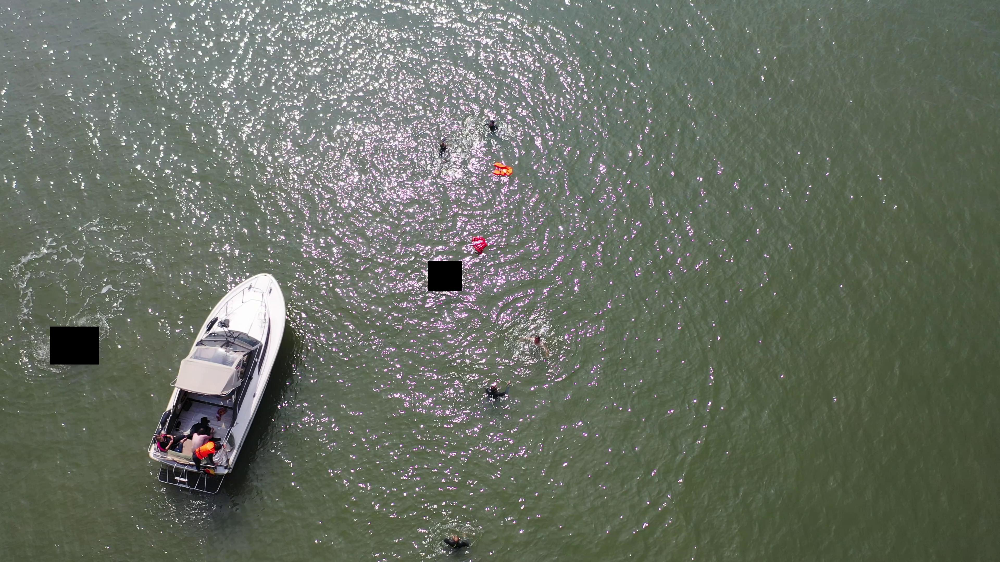
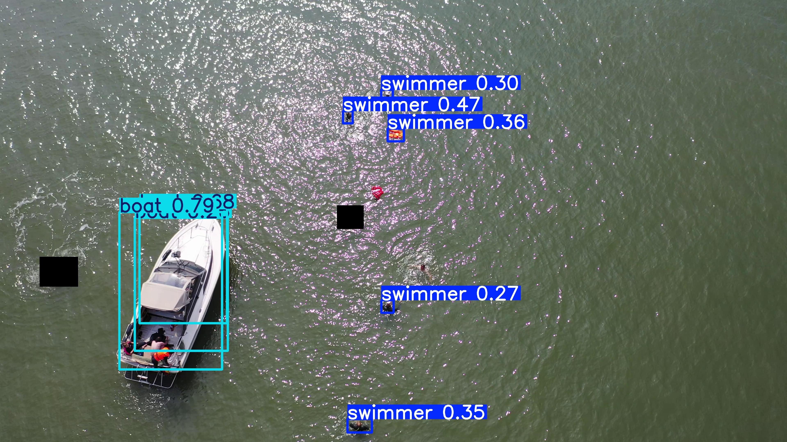

# Model Inference Guide – UAV Deployment

## Description

This document explains how to use the final fine-tuned object detection model developed in this research for real-world deployment, such as onboard a UAV.
The model was trained with our curated dataset to recognize specific maritime objects and is executed through the script. 

## Objective

- The script:

    - Loads final  model (fine-tuned with our dataset)
    - Accepts an image file path as input
    - Detects and classifies objects into the following categories: 
        - **boat** – vessels of any type or size visible in the UAV footage
        - **swimmer** – people in the water (swimming, floating, or partially submerged)
        - **other** – miscellaneous marine objects such as buoys, surfboards, paddleboards, jet skis, or similar items not classified as boats or swimmers
    - Displays the processed image with bounding boxes and labels

---

## Script Location

```bash
detector/detector.py
```

## Setup

1. Install the required packages

```bash
pip install -r requirements.txt
```

- Main dependencies:

    - Python 3.8+ 
    - Ultralytics 


## Running Inference

```bash
python detector.py path/to/image.jpg
```

- This will:
    - Run the model on the image;
    - Show a pop-up image with detections;
    - Print detection info to the terminal.

## Example:

#### Input Image

```bash
python detector.py images/input_example.jpg
```



#### Output




#### Terminal output

```bash
image 1/1 /vision_model_cimatec/detector/images/input_example.jpg: 384x640 5 swimmers, 3 boats, 65.8ms
Speed: 2.1ms preprocess, 65.8ms inference, 479.8ms postprocess per image at shape (1, 3, 384, 640)
```