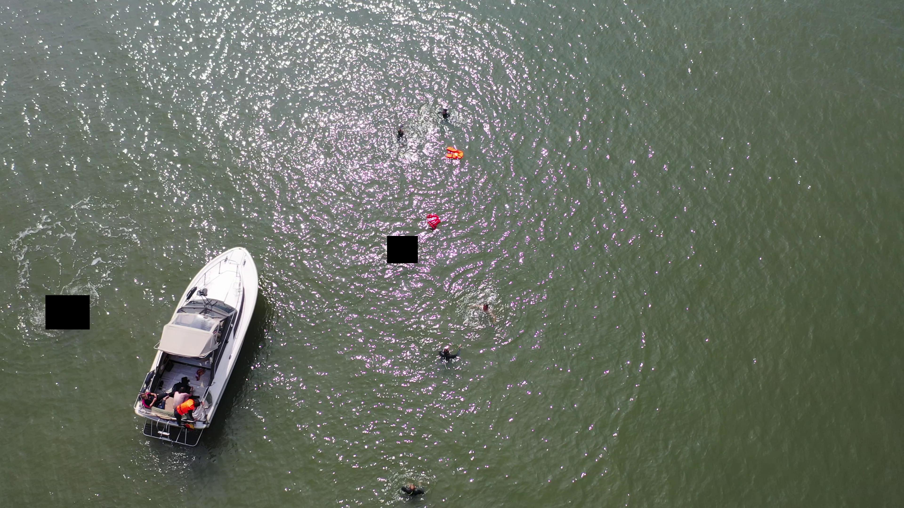
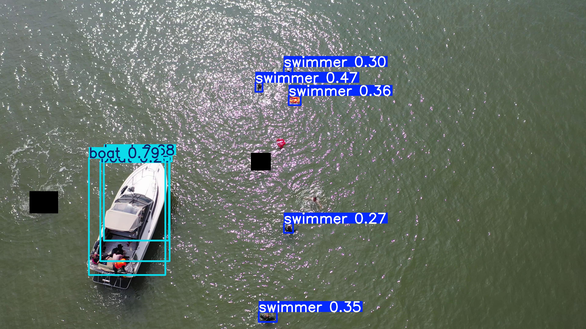

# Model Inference Guide – UAV Deployment

## Description

This document explains how to use the final fine-tuned object detection model developed in this research for real-world deployment, such as onboard a UAV.
The model was trained with our curated dataset to recognize specific maritime objects and is executed through the script. 

## Objective

- The script:

    - Loads final  model (fine-tuned with our dataset)
    - Accepts an image file path as input
    - Detects and classifies objects into the following categories: 
        - **boat** – vessels of any type or size visible in the UAV footage
        - **swimmer** – people in the water (swimming, floating, or partially submerged)
        - **other** – miscellaneous marine objects such as buoys, surfboards, paddleboards, jet skis, or similar items not classified as boats or swimmers
    - Displays the processed image with bounding boxes and labels

---

## Script Location

```bash
detector/scr/inference.py
```

## Setup

1. Install the required packages

```bash
pip install -r requirements.txt
```

- Main dependencies:

    - Python 3.8+
    - Torch
    - Torchvision
    - Pillow
    - random
    - Matplotlib
    - Ultralytics
    


## Running Inference

```bash
python inference.py --model name_of_model --conf [0;1] --image path/to/image.jpg
```
### Configuration

``--model`` (required):
- Model to use. Options:
    - YOLOv5
    - YOLOv8
    - YOLOv10
    - Faster R-CNN

``--conf`` (optional):
- Float number between 0 and 1 specifying the confidence threshold.

``--image`` (optional):
- Path to the image to process (relative to the project root).

### What Happens

- The model is applied to the specified image;
- A new image with detections is automatically saved.

## Example:

#### Input Image

```bash
python inference.py --model v10 --conf 0.3 --image images/input_example.jpg
```



#### Output




#### Terminal output

```bash
image: ../images/input_example.jpg: 2160x3840 7 objects
Resultado salvo em: ../detections\fasterRCNN_detection_20250820_162355_input_example.jpg
```